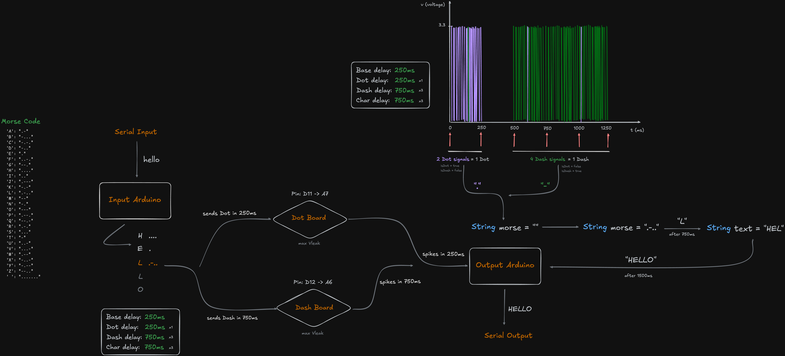

# Text2Morse

Implement Text-to-Morse and Morse-to-Text conversion using two Arduino Nano BLE 33 boards and two Lu.i boards.

### Note

There is a [demo](https://github.com/chubetho/Text2MorseWeb) for this project when there is no Arduino Nano or Lu.i board  .
